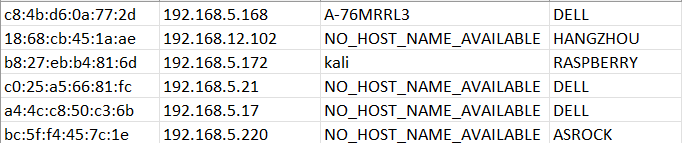
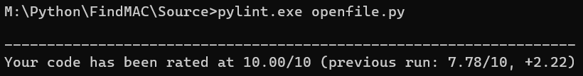
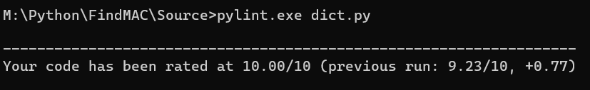
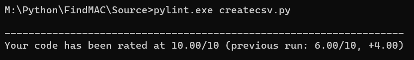

# MAC Details Finder #

### Table of Contents
**[Description](#description)** 
**[Requirements](#requirements)** 
**[Tested On](#tested-on)** 
**[Sample Execution](#sample-execution)** 
**[Input](#input)** 
**[Output](#output)** 
**[Functionalities](#functionalities)** 

# Description
This note is designed to share a bref idea about our new MAC details finder project.
In this project student will be provided a dhcp log which is shared belong to this file. From the dhcp log student will be comparing a single line and from the MAC address provided student will be fechting the details of the MAC and storing that in a CSV file as **MAC_Details**. Whole these will be done using the python code student have prepared in the **main.py** python file. In the main file all the functions are called from the Source folder. As per the setps student will be opening the dhcp file using the function **open_log_file**. After opening the file using the **for loop** student will be going line by line through the log file. Using the **split** command student will be spliting the file as the requirment. In the **if** clause student will be creating a condition for seprating the single line as student's requirment.Using the **strip** command student will be removing the brackets seperating the host details.The required values in the line are MAC address, IP address, Hostname.Adding on for checking only first 6 characters of the mac student will be separating it using string split.These are seprated and using an another **if** clause the empty host is mentioned as NO_HOST_NAME_AVAILABLE. A **empty list** is created and the sepreated values are added. Using the function **find_vend** student will be fectching the MAC address Vendor details from the dictonary.For avoiding the repetition student will be using an another **if** clause the details will be appended to the main list which was created earlier. As a conclusion using the **create_csv_file** function student will be creating a csv file for displaying the final output. Which is shown in the OUTPUT section below. This python code can be edited and used in many senarios.   

## Requirements
- Operating System : > Windows-11.
- Python :  > Version 3.10.7

## Tested On

Windows-11 with Python version 3.10.7

## Sample Execution 

Go to the project directory and run below command :
python
python main.py

## Input

- LOG_FILE = "./dhcpd.log"
- MAC_DETAILS = "./MAC_Details.csv"

## Output

This will create a nodes.csv with unique nodes connected the system. The generated csv file will have below details on the connected devices:
- Mac Address
- IP Address
- Hostname 
- VENDOR

Final result in the CSV:

## Functionalities

### Project.bat

This bat file is used to create a project templated. Using this template student will be creating a main folder and 4 subFolders for tracking and saving student's python related codes and details. Documentation folder is used to save the readme file with the project details. Example folder is used to save the example details. Source folder is used to save the function created related to the project. Test folder is used to save the unit testing student have done. And all other details and main program is saved in the FindMAC folder.

### openfile.py

This function is used to open the dhcp file where student are performing our action. if the file is present in the location mentioned then file will be accessed successfully. Student will be using a **try except** method for preventing unnessary faliure. It will returning a IO error, End of file error and general error if the file is having issues. Also student have created a print statment for opening the file and printing the dhcp log as a standalone script.Overall with this function student will be succefully accessing the dhcp log file.

### dict.py

This function is used to perform our main actions. In this student will be creating a **dictonary** for saving a the Vendor details of the MAC address. We will be checking only first 6 characters of the mac for fetching vendor details. As per the function according to the mac address recived the vendor details are fetched successfully.Student will be using a **try except** method for preventing unnessary faliure. Also student have created a return statment to print the mac address and vendor details.

### createcsv.py

This function is used to perform a csv file creation. Student will be creating a csv file for displaying the MAC address, IP address ,Host and Vendor details. As per the code all these details are pushed to a master list and this list details are pulled to the csv file. Using the **writer** student will be able to overwrite the details to csv for without repetition. Overall our project is successfully completed by creating the csv file.

### unit_test.py

This function is used to perform a unit testing for the functions student have created. A unit test will be performed to the **find_vend,open_log_file,** and **create_csv_file** functions. A test is done to make sure the function is working or not. Sample results are also created. If the functions are correct student will be getting a success response as test passed for all 3 function. If the function are failed this method will help us to track and resolve the issue. As unit testing is not working in the Test folder student have copied that to the Source folder and successfully executed.

## Pylint Testing

Additionally student will be doing a pylint test and results are mentioned below:

### openfile.py

### dict.py

### createcsv.py
