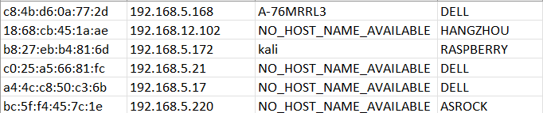

# MAC Details Finder #

### Table of Contents
**[Description](#description)** 
**[Requirements](#requirements)** 
**[Tested On](#tested-on)** 
**[Sample Execution](#sample-execution)** 
**[Input](#input)** 
**[Output](#output)** 
**[Functionalities](#functionalities)** 

# Description
This note is designed to share a bref idea about our new MAC details finder project.
In this project student will be provided a dhcp log which is shared belong to this file. From the dhcp log student will be comparing a single line and from the MAC address provided student will be fechting the details of the MAC and storing that in a CSV file as **MAC_Details**. Whole these will be done using the python code i have prepared in the **main.py** python file.

## Requirements
- Operating System : > Windows-11.
- Python :  > Version 3.10.7

## Tested On

Windows-11 with Python version 3.10.7

## Sample Execution 

Go to the project directory and run below command :
python
python main.py

## Input

- LOG_FILE = "./dhcpd.log"
- MAC_DETAILS = "./MAC_Details.csv"

## Output

This will create a nodes.csv with unique nodes connected the system. The generated csv file will have below details on the connected devices:
- Mac Address
- IP Address
- Hostname 
- VENDOR

Final result in the CSV:

## Functionalities

| Script   |      Usage      | 
|----------| :---------------|
| Project.bat | Batch file used to create project directories  | 
| openfile.py | To open and extract required details from dhcp log file| 
| dict.py | To get vendor details from the dictionary | 
| createcsv.py | To create required csv file for displaying the final result |
| unit_test.py | To perform unit testing on functions used in **openfile.py,dict.py** and **createcsv.py**  |